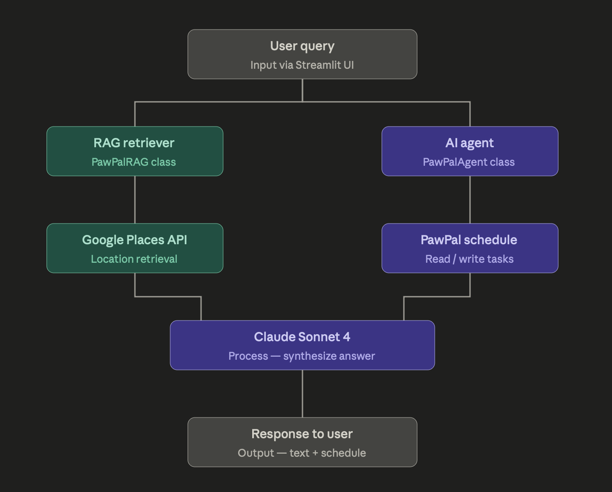
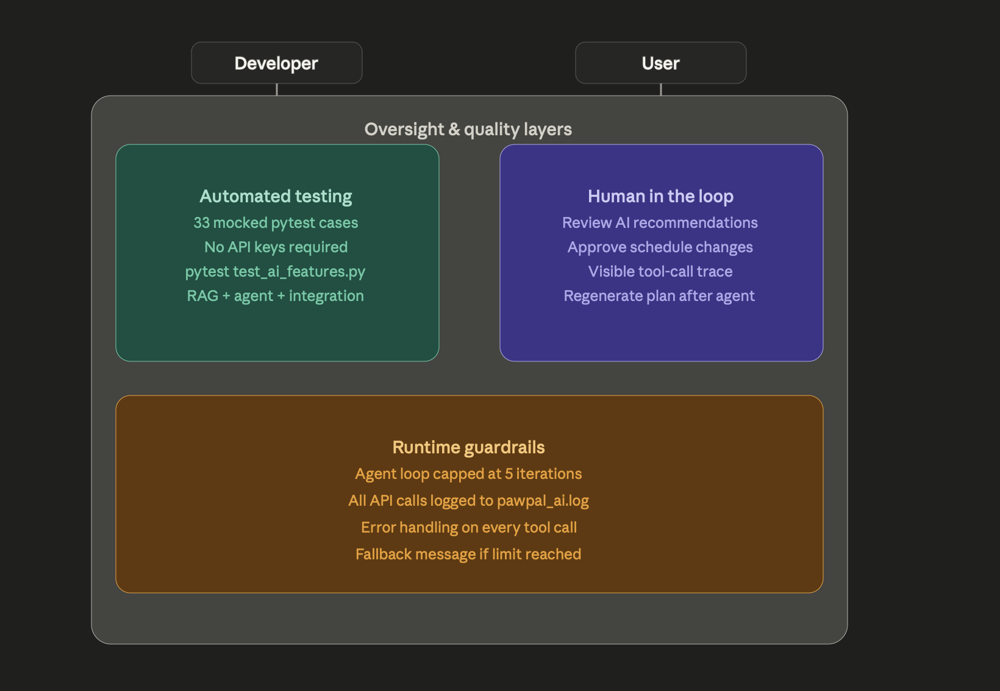

# PawPal+ AI

**An intelligent pet care scheduling assistant** powered by Claude Sonnet 4, featuring a RAG pipeline for real-time location discovery and an agentic workflow that autonomously manages pet schedules.

---

## Original project

This project extends **PawPal+**, built in Modules 1–3 of AI 110. The original app allowed a pet owner to create profiles for their pets, add care tasks (walks, feedings, medications, grooming), and generate a prioritized daily schedule that respected the owner's availability window. It included conflict detection, recurring task support, and a JSON-based persistence layer — but it had no AI features; all scheduling was rule-based Python logic.

---

## Title and summary

**PawPal+ AI** adds two integrated AI capabilities to the original scheduler:

1. A **RAG pipeline** that retrieves real nearby vets, parks, and pet supply stores from Google Places and uses Claude to generate grounded, context-aware recommendations — so the app never invents locations.
2. An **agentic workflow** where Claude autonomously calls tools to search for places, read the pet's schedule, check business hours, and add new tasks — completing multi-step scheduling requests in a single natural-language prompt.

Together these turn PawPal+ from a manual task tracker into a proactive AI scheduling assistant. A pet owner can type "find a good vet near me and add an appointment for Max on Saturday morning" and the system handles the rest.

---

## Architecture overview



The system has two parallel pipelines that share the same Claude model:

**RAG pipeline (left side):** The user's query triggers a Google Places Nearby Search, which returns up to 5 real locations. These are formatted into a plain-text context block and passed directly to Claude. Claude's answer is grounded exclusively in the retrieved data — it cannot hallucinate place names or addresses because the system prompt explicitly forbids it.

**Agentic pipeline (right side):** Claude is given five tools — `search_nearby_places`, `get_pet_schedule`, `add_location_to_schedule`, `get_next_appointment`, and `check_place_hours`. Claude autonomously decides which tools to call and in what order (Plan → Act → Verify loop), executing up to 5 iterations before a guardrail fires. Every tool call mutates the live `User` object, so any task Claude adds is immediately visible to the existing `TaskScheduler`.

Both pipelines converge at Claude Sonnet 4 and deliver a response through the Streamlit UI.



Quality is enforced at three levels: automated pytest (33 mocked tests, no API keys required), human-in-the-loop review via the visible tool-call trace in the UI, and runtime guardrails including a 5-iteration cap, full logging to `pawpal_ai.log`, and per-tool error handling.

---

## Setup instructions

**Requirements:** Python 3.9+, a free Anthropic API key, and a Google Places API key.

### 1. Clone and enter the repo

```bash
git clone https://github.com/Hdosseh1/ai110-module2show-pawpal-starter.git
cd ai110-module2show-pawpal-starter
```

### 2. Create and activate a virtual environment

```bash
python -m venv venv
source venv/bin/activate        # Windows: venv\Scripts\activate
```

### 3. Install dependencies

```bash
pip install -r requirements.txt
```

### 4. Create your `.env` file

Create a file named `.env` in the project root (same folder as `app.py`):

```
ANTHROPIC_API_KEY=sk-ant-your-key-here
GOOGLE_PLACES_KEY=AIzaSy-your-key-here
```

**Getting keys:**
- Anthropic key: [console.anthropic.com/settings/keys](https://console.anthropic.com/settings/keys) — free $5 credit on signup
- Google Places key: [console.cloud.google.com](https://console.cloud.google.com) → Enable Places API → Credentials → Create API Key — free $200/month credit

### 5. Run the app

```bash
streamlit run app.py
```

### 6. Run the tests (no API keys needed)

```bash
python -m pytest test_ai_features.py -v
```

---

## Sample interactions

### Sample 1 — RAG: finding a nearby vet

**Input:** User selects "Veterinary clinic", enters their coordinates, and asks *"Which of these is best for my dog who needs a routine checkup?"*

**AI output:**
> Based on the nearby locations retrieved, City Animal Hospital (4.7 stars, currently open) would be the best choice for a routine checkup. It has the highest rating of the options nearby and is open right now. Paws & Claws Vet (4.2 stars) is also a solid option if City Animal Hospital doesn't have availability — though it appears to be closed at this time.

The answer references only the two real locations returned by Google Places. No locations are invented.

---

### Sample 2 — Agent: adding a vet appointment

**Input:** *"Find the best-rated vet near me and add a 60-minute appointment to Max's schedule for tomorrow morning."*

**Agent tool call trace:**
1. `search_nearby_places` — category: vet, returns 5 nearby clinics
2. `add_location_to_schedule` — adds "Vet visit – City Animal Hospital", 60 min, morning, to Max

**AI output:**
> I found City Animal Hospital nearby with a 4.7-star rating. I've added a 60-minute vet appointment for Max tomorrow morning. Head to the sidebar and click Generate schedule to see it in your daily plan.

---

### Sample 3 — Agent: checking an existing appointment

**Input:** *"When is Max's next vet appointment, and is the vet open right now?"*

**Agent tool call trace:**
1. `get_next_appointment` — returns Max's "Vet visit – City Animal Hospital" task with next due date
2. `check_place_hours` — retrieves live hours for the place ID

**AI output:**
> Max's next vet appointment is scheduled for May 1st. City Animal Hospital is currently open — their hours today are 8:00 AM to 6:00 PM, and their phone number is (301) 555-0182.

---

## Design decisions

**Why separate `ai_features.py` from `app.py`?**
Keeping all AI logic in its own module means the original scheduling code in `pawpal_system.py` is completely untouched. If the AI features break or need to be disabled, a single import line is all that changes. It also makes the AI code independently testable without spinning up Streamlit.

**Why Google Places for RAG retrieval instead of a vector database?**
A vector database (Chroma, Pinecone) is the right tool when you need to search static documents — pet care articles, vet notes. For finding real nearby businesses that change daily (hours, ratings, new locations), a live API is strictly better. The retrieved data is always current and already structured, so there is no embedding step needed.

**Why Claude Sonnet 4 and not Opus?**
Sonnet 4 handles multi-step tool use and grounded synthesis well, runs significantly faster, and costs roughly 5× less per token than Opus. For a scheduling assistant where the user expects near-instant responses, Sonnet is the right trade-off. Opus would be justified only for complex reasoning tasks where accuracy is worth the latency and cost.

**Why cap the agent at 5 iterations?**
Without a hard ceiling, a misbehaving prompt or an unexpected tool result could cause the agent to loop indefinitely, burning API credits. Five iterations is enough to handle any realistic scheduling request (search → check hours → add task is 3 iterations). The guardrail fires rarely in practice but is essential for a production-like system.

---

## Testing summary

The test suite (`test_ai_features.py`) contains 33 tests across 8 classes, all using `unittest.mock` to patch the Anthropic and Google Places APIs. This means tests run instantly, require no API keys, and are fully deterministic.

**What worked well:**
- Mocking at the `requests.get` and `anthropic.Anthropic.messages.create` level made it straightforward to simulate any API response, including failures and malformed data.
- The integration tests (last class) were the most valuable — they proved that tasks added by the AI agent flow correctly through the existing `TaskScheduler` and respect medication priority ordering.
- The MAX_ITERATIONS guardrail test confirmed the safety net works by simulating a looping agent and asserting it terminates gracefully.

**What was challenging:**
- Mocking the Anthropic client's multi-turn conversation (tool use blocks followed by a final text block) required careful construction of mock objects with the right `.type`, `.id`, and `.input` attributes. Getting the shape of these mocks exactly right took iteration.
- The agent's `side_effect` pattern (different responses on consecutive calls) was unintuitive at first but is the correct approach for testing stateful loops.

**What was learned:**
- Testing agentic code requires thinking about it as a state machine: what is the conversation history at each step, and what does the mock need to return at each turn?
- Separating retrieval from generation (the core RAG idea) makes both steps individually testable, which is a strong practical argument for the pattern beyond the quality benefits.

---

## Reflection

Building PawPal+ AI clarified something important about working with language models: the hardest part is not getting Claude to produce good text — it does that readily — but controlling *what information* Claude has access to when it generates that text. The RAG pipeline is fundamentally about information discipline: the system prompt tells Claude it may only use the retrieved context, and the context is deliberately narrow (5 nearby places, formatted plainly). The result is an assistant that is reliably accurate rather than occasionally brilliant.

The agentic workflow surfaced a different lesson: agents are not magic. They are a loop with a tool dispatcher and a conversation history. Once that mental model clicks, the implementation becomes straightforward — and so does reasoning about failure modes. The MAX_ITERATIONS guardrail, the per-tool error handling, and the tool-call trace in the UI all follow naturally from thinking of the agent as a loop that can go wrong in specific, predictable ways.

The biggest surprise was how cleanly the AI features integrated with the existing Python code. Because `PawPalAgent._tool_add_location_to_schedule` calls `pet.add_task()` directly on the live `User` object, the agent and the original scheduler share the same data with zero duplication. This made the integration tests almost trivial to write, which is usually a sign the architecture is right.
